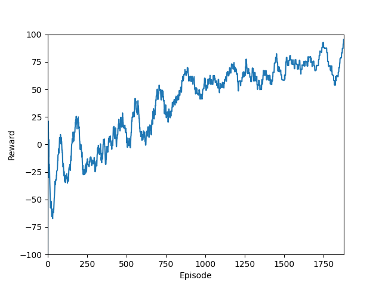

# Q-Learning Grid-World Sandbox
A minimalist, fully-self-contained playground that lets you train, watch and tweak a Deep Q-Learning agent as it learns to reach a goal and avoid traps on a tiny grid. Everything—environment, agent, training loop and a live Pygame visualiser. It is simple and fewer than 300 lines of Python, making it perfect for teaching, experimentation and portfolio work.
---
## Table of Contents
1. [Quick Start](#quick-start)
1. [Project Structure](#project-structure)
1. [How Q-Learning Works](#how-q-learning-works)
1. [Q-Learning in this project](#q-learning-in-this-project)
1. [License](#licence)
1. [TODO](#todo)
---

## Quick Start
1. Clone & install
```bash
git clone https://github.com/rorzor/QLearnPlayGround.git
cd QLearnPlayGround
python -m venv .venv && source .venv/bin/activate   # optional
pip install -r requirements.txt
```
Requirements: Python 3.9+, TensorFlow 2.x, NumPy, Matplotlib, Pygame.
A ready-made requirements.txt is provided.

2. Train an Agent
```bash
python train.py
```
* Amoving average reward curve will open during training
* A model file <code>qlearning_model.keras</code> is auto-saved every 20 episodes

<p align="center">
  
</p>

3. Watch the trained agent
```bash
python simulate.py
```
Controls within the Pygame window:
| Key | Action |
| ----|--------|
| Space | Let the trained agent make a move|
| 🡡🡣🡠🡢 | Manual step (to inspect the environment) |
| Esc / window close | Quit |

---

## Project Structure
|File	|Purpose|
|-------|-------|
|environment.py	| Defines the 3 × 3 GridWorld MDP, reward scheme and step/reset logic environment |
| agent.py	| Implements a Deep Q-Network agent, experience-replay buffer and optional target network agent |
| train.py	| End-to-end training loop, epsilon-greedy schedule and live plotting train |
| simulate.py |	Pygame front-end to visualise the learned policy in real time simulate |
| settings.py |	Centralised hyper-parameters (e.g. USE_TARGET, batch size) settings |
| visualise.py	|(Legacy) ASCII re-player for pickled game evolutions |
---

## How Q-Learning Works
At its core, Q-Learning is an off-policy reinforcement-learning algorithm which learns an action-value function

by iteratively applying the Bellman Optimality Equation

1. Act – pick an action a in state s (usually ε-greedy).

1. Observe – receive reward r and next state s′.

1. Bootstrap – compute target 

1. Update – move network weights θ toward y (e.g. by MSE).

Because the state–action space grows exponentially, we approximate Q with a neural network (DQN).

Key ideas that make modern DQN stable:

* Experience Replay – random mini-batches break temporal correlations.

* Target Network – a slowly updated copy gives a semi-stationary target.
---

## Q-Learning in <i>this</i> project
Many of these are easily configurable within the referenced files:
|Concept	|Implementation details|
|---|---|
|State	|Flattened 3×3 grid (values: 3 = agent, 2 = goal, −2 = trap, 0 = empty) ⇒ vector length 9 <code>environment</code>
|Actions | <code>0 = up</code>, <code>1 = down</code>, <code>2 = left</code>, <code>3 = right</code>
|Rewards | +100 goal, −100 trap, −1 move cost, −5 wall collision <code>environment</code>
|Network |	Dense (100 → 50 → 4) ReLU + Linear head <code>agent</code>
|Exploration |	ε starts at 1.0, decays by 0.9995 each episode until 0.20 <code>train</code>
|Experience Buffer |	<code>deque(maxlen=2000)</code> with uniform random sampling <code>agent</code>
|Target Net |	Enabled (<code>USE_TARGET = True</code>) and synced every 5 episodes
|Training Loop | Per-step online fit + replay every episode once buffer ≥ 64

Algorithm in pseudocode:
```
for episode in range(episodes):
    s = env.reset()
    for t in range(max_moves):
        a = ε-greedy(s)
        s', r, done = env.step(a)
        store(s,a,r,s',done)
        train_online(s,a,r,s',done)
        if done or t == max_moves: break
    if buffer ≥ 64: replay(batch)
    if episode % TARGET_UPDATE_INTERVAL == 0: sync target
    ε = max(ε_min, ε * ε_decay)
```
## Licence

[MIT](https://mit-license.org/)
Feel free to use as you wish, PRs are very welcome :)

## TODO:

### Customising and Extending

### Results & Benchmarks

### Future Roadmap / TODO